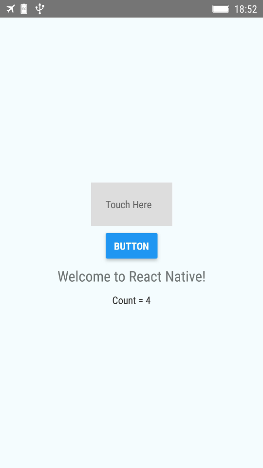

# Лабораторна робота № 6. Створення крос-платформного мобільного додатку

**Мета роботи:** створити власний крос-платформний мобільний додаток використовуючи на вибір технології Xamarin, Unity3D, React Native.

Хід роботи:
1. Встановити на вибір середовище Xamarin, Unity3D, React Native.
1. Написати власний додаток або скомпілювати один з додатків-прикладів.
1. Виконати на мобільному телефоні.
1. Проаналізувати, з яких компонентів складається додаток, як він виконується.
1. Написати звіт.

Приклади додатків для роботи:
1. Xamarin: https://github.com/xamarinhq/app-myshoppe
1. React Native: https://github.com/amaurymartiny/shoot-i-smoke
1. Unity3D: https://unity3d.com/ru/learn/tutorials/topics/mobile-touch/building-your-unity-game-android-device-testing
  
У наведеному прикладі для ReactNative:

1. Інсталювати Node.JS (https://nodejs.org/uk/download/)
1. Встановити все необхідне для Вашої платформи (https://facebook.github.io/react-native/docs/getting-started)
1. Створити проект `react-native init NewProject`
1. Відредагувати `App.js` файл:

``` JSX
import React, {Component} from 'react';
import {Platform, StyleSheet, Text, View, Button, TouchableOpacity} from 'react-native';

type Props = {}; /// (1)
export default class App extends Component<Props> {
  constructor(props)
  {
     super(props)
     this.state = { count: 0 } /// (2)
  }
  onPress = () => { /// (3)
    this.setState({ /// (4)
      count: this.state.count+1
    })
  }
  render() { /// (5)
    return ( /// (6)
      <View style={styles.container}>
        <TouchableOpacity style={styles.button} onPress={this.onPress} >
            <Text>Touch Here</Text>
        </TouchableOpacity>
        <Button style={styles.button} onPress={this.onPress} title="Button"/>
        <Text style={styles.welcome}>Welcome to React Native!</Text>
        <Text style={styles.text}>Count = {this.state.count}</Text>
      </View>
    );
  }
}

const styles = StyleSheet.create({
  container: {
    flex: 1,
    justifyContent: 'center',
    alignItems: 'center',
    backgroundColor: '#F5FCFF',
  },
  welcome: {
    fontSize: 20,
    textAlign: 'center',
    margin: 10,
  },
  text: {
    textAlign: 'center',
    color: '#333333',
    marginBottom: 5,
  },
  button: {
    alignItems: 'center',
    backgroundColor: '#DDDDDD',
    padding: 20,
    margin: 10,
  },
});
```

Пояснення:
1. Тепер в React можна задати вимоги до властивостей і дочірніх об'єктів: https://medium.com/flow-type/even-better-support-for-react-in-flow-25b0a3485627, https://flow.org/en/docs/react/children/
2. Стан компонента складається з одного поля - `count`
3. Функції в JavaScript можна задавати у вигляді (список_параметрів) => {тіло функції}
4. Встановлення стану об'єкта - лише через виклик `setState` (для більших проектів бажано стан тримати окремо, див. https://www.slideshare.net/ChiewCarol/react-native-reduxes6-updated)
5. render() по замовченню виконується кожен раз, коли змінюється стан, і повертає нове дерево компонентів. React порівнює його зі старим і робить лише необхідні зміни, щоб не перестворювати всі елементи заново
6. JSX дозволяє поєднувати код на JavaScript і XML. При цьому XML перетворюється на виклики JavaScript (https://frontarm.com/james-k-nelson/jsx-live-cheatsheet/)


